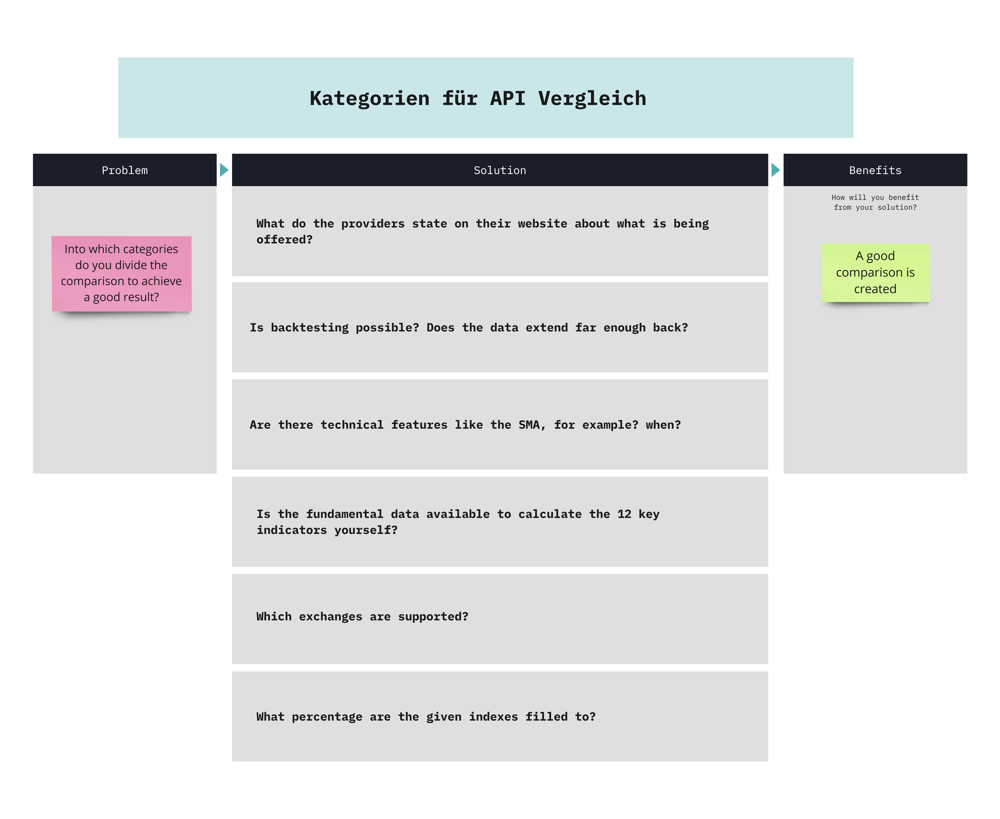
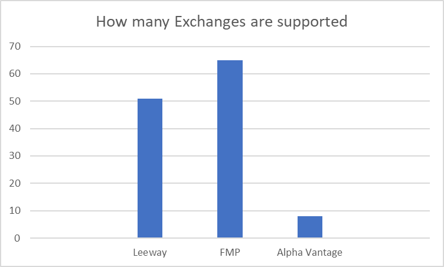
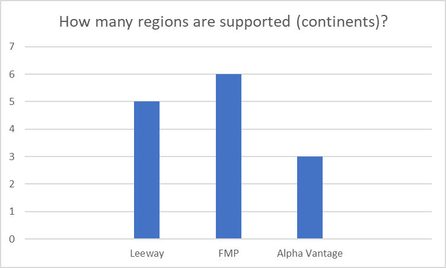

## **What do the providers state on their website about what is being offered?**

### [Alpha Vantage](https://www.alphavantage.co/)

- Realtime & historical stock market data APIs

- Forex, commodity & crypto data feeds

- 60+ technical & economic indicators

- Market news API & sentiments

- Global coverage

### [Financial Modeling Prep](https://site.financialmodelingprep.com/developer/docs/pricing/)

- Financial statements and multiple metrics for over 30,000 companies across the world

- Stock prices and profile for more than 40,000 symbols

- News and press realeses in real-time categorized by stock symbol

- Multiple economic data like inflation rates, GDP, economic calendar and more

- Many ready to use packages for multiple languages.

- Social sentiment across different social media like Twitter or Reddit

- Insider trading for U.S. stocks gathered from SEC forms

- Processed 13-F forms, mutual fund holders and insitutional holders

- SEC filings, transcripts, etf holders, earnings calendar and many more.

### [Leeway](https://leeway.tech/data-api)

- Provides access to comprehensive financial data from over 50 exchanges worldwide. (Among others, in Germany, there are Xetra and Frankfurt Stock Exchange, the Euronext exchanges in Paris and Amsterdam, and of course, in the USA, including New York Stock Exchange (NYSE) and NASDAQ.)

- fundamental data, including annual and quarterly financial statement data with up to 20 years of history, closing prices with the complete historical record, interval price data, and much more.

- Stocks, ETFs, indices, funds, currencies, and cryptocurrencies. For stocks and ETFs, also master data, and for stocks, fundamental data as well.

- Price data API, Fundamental data API, live delayed prices, interval price data, forex, crypto, and commodities, funds & ETF API, bonds, macroeconomic data, event calendar, event history.

## Quality of the Support:

To test the response time and quality of support, a test email was composed and sent to the four providers. FMP and Leeway provided a reasonable and satisfactory response. There was no response from Alpha Vantage.

### Email for Support Test:

Subject: API Support Responsiveness

Dear …,

We are currently evaluating various Finance/Stock API providers for a project I am working on. As part of this evaluation, I wanted to test the responsiveness of your support team.

Could you please confirm the receipt of this email by replying to it? This will help me determine the efficiency of your support system and give me confidence in considering your API services for integration.

Thank you for your time and attention. I look forward to your response.

Best regards,

## Is Backtesting possible?

Backtesting involves applying a strategy or predictive model to historical data to determine its accuracy.
It allows traders to test trading strategies without the need to risk capital.
Common backtesting measures include net profit/loss, return, risk-adjusted return, market exposure, and volatility.

The time period for backtesting with a financial APIs depends on the specific trading or investment strategy and the data you need for the analysis. There isn't a one-size-fits-all answer to how far back the historical data should go, as it can vary based on factors such as your trading frequency, asset class, and the nature of your strategy.

In this case the answer is still easy because if you wanted to backtest with the 12 Stock key figures we calculated in the last Project, it would not be possible to calculate for example, the Price to Earning with Alpha Vantage, because they only provide the current EPS in the Company Overview. Also the fundamentaldata only goes back to 2018.

FMP provides 15+ years of Financial Statements, including international filings.

Leeway provides fundamental data back up to 30 years and the historical prices of up to 100 years.

Having access to such extensive historical data allows for more in-depth and comprehensive backtesting of strategies. Traders and investors often rely on long-term historical data to analyze the performance of their strategies under various market conditions and economic cycles. Therefore, FMP and Leeway would be better suited for backtesting purposes when compared to Alpha Vantage, especially if you require a longer historical perspective for your analysis.

# Which and how many exchanges and markets are supported?

Everything that is in these tables was taken as it was provided.

## Leeway:

| Symbol | Description |
| --- | --- |
| AS | Euronext Amsterdam |
| AU | Australia Exchange |
| BK | Thailand Exchange |
| BOND | Bonds |
| BR | Euronext Brussels |
| BSE | Bombay Exchange |
| BUD | Budapest Stock Exchange |
| CC | Crypto-Currencies |
| CO | Coppenhagen Exchange |
| COMM | Commodities & Futures |
| DU | Dusseldorf Exchange |
| EUFUND | Europäische Fonds |
| F | Frankfurt Exchange |
| FOREX | Forex |
| GBOND | Governement Bonds |
| HE | Helsinki Exchange |
| HK | Hong Kong Exchange |
| HM | Hamburg Exchange |
| IC | Iceland Exchange |
| INDX | Indices |
| IS | Istanbul Stock Exchange |
| JK | Jakarta Exchange |
| KAR | Karachi Stock Exchange |
| KLSE | Kuala Lumpur Exchange |
| KQ | KOSDAQ |
| LS | Euronext Lisbon |
| LSE | London Exchange |
| MC | Madrid Exchange |
| MCX | MICEX Russia |
| MI | Borsa Italiana |
| MU | Munich Exchange |
| MX | Mexican Exchange |
| NASDAQ | NASDAQ |
| NFN | Nasdaq First North |
| NYSE | NYSE |
| OL | Oslo Stock Exchange |
| PA | Euronext Paris |
| SA | Sao Paolo Exchange |
| SG | Singapore Exchange |
| SHE | Shenzhen Exchange |
| SHG | Shanghai Exchange |
| SR | Saudi Arabia Exchange |
| ST | Stockholm Exchange |
| SW | SIX Swiss Exchange |
| TA | Tel Aviv Exchange |
| TO | Toronto Exchange |
| TSE | Tokyo Stock Exchange |
| TW | Taiwan Exchange |
| VI | Vienna Exchange |
| VN | Vietnam Stocks |
| XETRA | XETRA |

### Financial modeling prep:

| Symbol | Description |
| --- | --- |
| ATH | Athens Stock Exchange  |
| ASX | Australian Stock Exchange  |
| BER | Berlin Stock Exchange  |
| BSE | Bombay Stock Exchange  |
| IST | Borsa Istanbul  |
| BUD | Budapest Stock Exchange  |
| BUE | Buenos Aires Stock Exchange  |
| CSE | Canadian Securities Exchange  |
| CBOT | Chicago Board of Trade  |
| CME | Chicago Mercantile Exchange  |
|  | Currency Rates |
|  | Deutsche Boerse XETR |
|  | Dow Jones Indexes |
| DUS | Dusseldorf Stock Exchange  |
| EGX | Egyptian Stock Exchange  |
|  | Euronext |
|  | Euronext Amsterdam |
|  | Euronext Brussels |
|  | Euronext Dublin |
|  | Euronext Lisbon |
| PAR | EURONEXT Paris  |
| FSX | Frankfurt Stock Exchange  |
|  | FTSE Indices |
| HAM | Hamburg Stock Exchange  |
| HKEX | Hong Kong Stock Exchange  |
| IDX | Indonesia Stock Exchange  |
| JSE | Johannesburg Stock Exchange  |
| KOE | Korea Exchange  |
| KOSDAQ | Korea Exchange  |
|  | London Stock Exchange |
|  | Madrid SE C.A.T.S. |
|  | Malaysian Stock Exchange |
| BMV | Mexico Stock Exchange  |
| MIL | Milan Stock Exchange  |
| MOEX | Moscow Exchange  |
| MUN | Munich Stock Exchange  |
| CPH | NASDAQ Copenhagen  |
| HEL | NASDAQ Helsinki  |
|  | Nasdaq Stock Exchange |
| NSE | National Stock Exchange of India  |
| NEO | NEO Exchange  |
| COMEX | New York Commodities Exchange  |
| NYSE | New York Stock Exchange  |
| NZE | New Zealand Stock Exchange  |
| OSE | Oslo Stock Exchange  |
| OTC | OTC Markets US  |
| PRA | Prague Stock Exchange  |
| QE | Qatar Stock Exchange  |
| SGO | Santiago Stock Exchange  |
| BOVESPA | Sao Paulo Stock Exchange  |
| Tadawul | Saudi Stock Exchange  |
| SHH | Shanghai Stock Exchange  |
| SHZ | Shenzhen Stock Exchange  |
| SGX | Singapore Stock Exchange  |
| SET | Stock Exchange of Thailand  |
| STO | Stockholm Stock Exchange  |
| STU | Stuttgart Stock Exchange  |
| SIX | Swiss Stock Exchange  |
| TWSE | Taiwan Stock Exchange  |
| TASE | Tel Aviv Stock Exchange  |
| TAL | The Nasdaq Tallinn AS  |
| TSE | Tokyo Stock Exchange  |
| TSX | Toronto Stock Exchange  |
| TSXV | TSX Venture Exchange  |
|  | Vienna Stock Exchange |

### Alpha Vantage:

| Symbol | Description |
| --- | --- |
|  | NASDAQ |
|  | London Stock Exchange |
|  | Toronto Stock Exchange |
|  | Toronto Venture Exchange |
|  | XETRA |
|  | BSE |
|  | Shanghai Stock Exchange |
|  | Shenzhen Stock Exchange |

## How many and which regions are supported?

| Leeway | FMP | Alpha Vantage |
| --- | --- | --- |
| Europe | Europe | Europe |
| North America | North America | North America |
| South America | South America | Asia |
| Australia | Australia |  |
| Asia | Asia |  |
|  | Africa |  |

# **Is the fundamental data available to calculate the 12 key indicators yourself?**

| Indicator | Alpha Vantage | FMP | Leeway |
| --- | --- | --- | --- |
| Revenue Growth  = (Current Period Revenue - Prior Period revenue) / Prior period revenue | totalRevenue (Income Statement) | revenue (Income Statement) | totalRevenue (Fundamentals → Income Statement) |
| Gross Profit = Revenue – Cost of Revenue | totalRevenue (Income Statement) - costOfRevenue (Income Statement) | revenue (Income Statement) - costOfRevenue (Income Statement) | totalRevenue (Fundamentals → Income Statement) - costOfRevenue (Fundamentals → Income Statement) |
| ROE = Net Income / Shareholders' Equity | netIncome (Income Statement) / totalShareholderEquity (Balance Sheet) | netIncome (Income Statement) / totalStockholdersEquity (Balance Sheet) | netIncome (Fundamentals → Income Statement) / totalStockholdersEquity (Fundamentals → Balance Sheet) |
| Equity Ratio = Shareholder's Equity / (Liabilities + Shareholders' Equity) |  totalShareholderEquity (Balance Sheet) / (totalLiabilities (Balance Sheet) + totalShareholderEquity (Balance Sheet)) | totalStockholdersEquity (Balance Sheet)    / (totalLiabilities (Balance Sheet) +   totalStockholdersEquity (Balance Sheet)) |  totalStockholdersEquity (Fundamentals → Balance Sheet) / ( totalLiab (Fundamentals → Balance Sheet) + totalStockholdersEquity (Fundamentals → Balance Sheet)) |
| Gearing = Total Debt / Total Shareholders' Equity | longTermDebtNoncurrent (Balance Sheet) / totalShareholderEquity (Balance Sheet) | longtermdebtnoncurrent (Balance Sheet as Reported) / totalStockholdersEquity (Fundamentals → Balance Sheet) | longTermDebt (Fundamentals → Balance Sheet) / totalStockholdersEquity (Fundamentals → Balance Sheet) |
| Market Capitalization = Current Market Price per share * Total Number of Outstanding Shares | Close (Time Series Intraday) * SharesOutstanding (Company Overview) | Close (1min historical stock prices with volume) * weightedaveragenumberofdilutedsharesoutstanding(financial statement full as reported) | Close (Intraday) * SharesOutstanding ( Fundamentals → SharesStats) |
| EV = market capitalization + total debt - cash and cash equivalents | Market Capitalization + longTermDebtNoncurrent (Balance Sheet) - cashAndCashEquivalentsAtCarryingValue (Balance Sheet) | Market Capitalization  + longtermdebtnoncurrent (Balance Sheet as Reported) - cashandcashequivalentsatcarryingvalue (balance sheet as reported) | Market Capitalization + longTermDebt (Fundamentals → Balance Sheet) - cashAndEquivalents (Fundamentals → Balance Sheet) |
| EV/R = EV / Total Revenue | EV / totalRevenue (Income Statement)  | EV / revenue (Income Statement) | EV / totalRevenue (Fundamentals → Income Statement) |
| EBITDA = Income Tax Expense+ Interest Expense + Net income + Depreciation and Amortization | incomeTaxExpense (Income Statement) + interestExpense (Income Statement) + netIncome (Income Statement) + depreciationAndAmortization (Income Statement) | incomeTaxExpense (Income Statement) + interestExpense (Income Statement) + netIncome (Income Statement) + depreciationAndAmortization (Income Statement) | IncomeTaxEspense (Fundamentals → Income Statement) + InterestExpense (Fundamentals → Income Statement) + netIncome (Fundamentals → Income Statement) + deprecationAndAmortization (Fundamentals → Income Statement) |
| EV/EBITDA = EV / EBITDA | EV / EBITDA | EV / EBTIDA | EV / EBTIDA 
| P/E = Stock Price / Earnings Per Share | Close (Time Series Intraday) / EPS (Company Overview) | Close (1min historical stock prices with volume) / earningspersharebasic (financial statement full as reported) | Close (Intraday) / EarningsShare (Fundamentals → Highlights) |
| P/B = Stock Price / (total shareholder equity / Shares outstanding) | Close (Time Series Intraday) / SharesOutstanding (Company Overview) | Close (1min historical stock prices with volume) / weightedaveragenumberofdilutedsharesoutstanding (financial statement full as reported) | Close (Intraday) / SharesOutstanding( Fundamentals → SharesStats) |
| P/CF = Stock Price / (Operating Cash Flow / Shares Outstanding) | Close (Time Series Intraday) / (operatingCashflow (Cash flow) / SharesOutstanding (Company Overview)) | Close (1min historical stock prices with volume) /(operatingCashFlow (Cash flow) / weightedaveragenumberofdilutedsharesoutstanding (financial statement full as reported)) | Close (Intraday) / (totalCashFromOperatingActivities (Fundamentals → Cash Flow) / sharesOutstanding( Fundamentals → SharesStats)) |

## How often is the fundamental data updated?

To get an reliable answer to that, we asked the API providers themselves.

**FMP**: FMP updates its Financial Statement endpoint after a few minutes/hours of data being published on the SEC for US companies. For international filings, updates occur daily. These updates are frequent and aim to provide near-real-time data for US companies.

**Leeway**: Leeway updates its data daily, but there might be a slight delay after the release of earnings reports. The update timing can vary based on factors like the size of the company, how quickly they publish their reports, and market conditions. Similar to FMP, Leeway provides daily updates with potential delays for earnings reports.

**Alpha Vantage**: Alpha Vantage's data is generally refreshed on the same day a company reports its latest earnings and financials. While they did not  respond to the E-Mail, it is stated on their website, this indicates a daily update frequency, similar to FMP and Leeway.

In summary, all three API providers aim to offer daily data updates, which is a standard practice in the financial data industry. Whether you need near-real-time updates (FMP), daily data with potential delays (Leeway), or daily data refreshes (Alpha Vantage), you have options to suit your trading and analytical needs.

## Are there technical features like the SMA, for example?

Technical features are used in the Technical Analysis of Stocks and the Technical Analysis is the study of historical market data, including price and volume.

- Technical analysis attempts to predict future price movements, providing traders with the information needed to make a profit.

- Traders apply technical analysis tools to charts in order to identify entry and exit points for potential trades.

- An underlying assumption of technical analysis is that the market has processed all available information and that it is reflected in the price chart.

Alpha Vantage provides a wide variety of technical features. There are [53 Technical features available](https://www.alphavantage.co/documentation/#technical-indicators), these include, for example, the SMA, EMA, WMA, etc.

FMP provides [9 Technical Indicators in the Technical Indicators Intraday API](https://site.financialmodelingprep.com/developer/docs/technicals-intraday-api/), and [1 more in Chart Market Stock Data API](https://site.financialmodelingprep.com/developer/docs/historical-stock-data-free-api/). So in total, there are only 10 Technical Indicators that FMP provides.

Leeway provides 9 Technical Indicators that are listed in the big JSON file that they output in /api/v1/public/historicalquotes/marketcap/{symbolExchange} [in the Fundamentals](https://leeway.tech/api-doc/general?lang=ger&dataapi=true)

## How good is the API Documentation?

FMP stands out with its exceptional API documentation. They offer an extensive range of financial-related data, comprehensively categorized into their respective areas, accompanied by detailed explanations. Additionally, FMP provides a valuable resource by offering a page containing individual [formulas](https://site.financialmodelingprep.com/developer/docs/formula) for various financial ratios, which greatly aids developers and users. The documentation also includes language-specific guides to enhance usability.

A standout feature of FMP's documentation is its provision of property listings for Financial Reports, including Income Statements, Balance Sheets, and Cash Flow. This unique feature saves users the hassle of having to make API calls first to determine whether specific values are available.

In summary, FMP's API documentation sets a high standard, offering comprehensive data, formula references, and convenient property listings, making it a top choice for users seeking detailed and user-friendly financial data resources.

    Since FMP has made changes to its website, here is a new evaluation of the documentation:

    The new documentation for FMP retains its organizational structure and categories from the previous version. However, there are notable changes. Descriptions for various sections have been streamlined and are now somewhat shorter, providing concise information.

    One significant change is the removal of the functionality that allowed users to click on listed items, such as Financial Statements, to access a separate page detailing the properties of financial reports. Instead, users are presented with a clear guide showing the parameters that can be utilized for each respective statement. It's important to note that these parameter descriptions serve as a reference for users to understand the available options for customization but are not directly usable values.

    An aspect that may pose a minor inconvenience is the scrolling behavior. When the mouse cursor is positioned within the statement display, scrolling is limited to within the statement itself, making it less intuitive to navigate the entire webpage.

    Despite these minor drawbacks, FMP continues to offer the most comprehensive and detailed API documentation among the available options.

>   [Here is a link to the new documentation](https://site.financialmodelingprep.com/developer/docs)

[Alpha Vantage's API documentation](https://www.alphavantage.co/documentation/), while comprehensive, has some notable differences compared to FMP's documentation. While it provides categorized information with descriptions and examples for various parameters, it offers a more limited range of data compared to FMP.

One area where Alpha Vantage falls short is in providing formulas that explain how the ratios are composed or calculated. This can be a disadvantage for users who want a deeper understanding of the financial metrics they are working with.

However, Alpha Vantage does offer language-specific guides for the API, which can be helpful for developers working in different programming languages.

One notable distinction is that Alpha Vantage's documentation lacks an upfront overview of what is listed in the respective documents. This means that users may need to make API calls to explore the available data, which can be less convenient compared to FMP's approach of providing an upfront overview of data properties.

In summary, Alpha Vantage's API documentation is comprehensive but lacks certain features and detailed formulas found in FMP's documentation. Users may need to make API calls to explore the available data fully.

[Leeway's API documentation](https://leeway.tech/api-doc/general?lang=ger&dataapi=true) is notably less user-friendly compared to other providers. The design and presentation of the documentation can be a drawback. Leeway's documentation uses URL endpoint resources, which might lead to confusion when users are trying to find specific information.

While Leeway categorizes information into respective areas like other APIs, the design can be challenging to navigate, especially for users new to the API. However, it does offer a brief description for each endpoint, which is well done and provides some guidance.

One positive aspect of Leeway's documentation is its capability to allow users to pass the exchange directly in the request, which can be a convenient feature for those looking to access exchange-specific data.

Despite these attributes, Leeway's documentation lacks detailed formulas explaining metrics and financial ratios, and it also doesn't offer an upfront overview of what is available in the fundamentals, which could be useful for users seeking a quick reference.

In summary, Leeway's API documentation may require users to spend more time navigating and exploring the documentation compared to other providers, and it lacks certain features found in more user-friendly documentation.

## Are there access limitations in the free version/ Is there a premium version?

Each of the three API providers has premium versions of their API, along with limitations in the free version.

For Financial Modeling Prep, there are four different versions available:

1. Free: Provides access only to the US market, allows 250 requests per day, no access to premium endpoints, a maximum limit of 5 for all endpoints, and access to only annual data.
2. Starter for $19/month: Offers 100% market coverage, allows 300 API requests per minute, provides 30 years of historical data, and can be canceled at any time.
3. Professional for $49/month: Also provides 100% market coverage, allows 750 API requests per minute, grants access to premium endpoints, offers 30 years of historical data, includes chat and email priority support, bulk download endpoints, WebSocket, and can be canceled at any time.
4. Enterprise for $99/month: Offers 100% market coverage, 1,500 calls/minute, access to premium endpoints, 30 years of historical data, is allowed for commercial use (unlike the others), includes chat and email priority support, a 99.95% uptime SLA, bulk endpoints, stock ownership endpoints, WebSocket, and can also be canceled at any time.

        FMP has since changed the prices and names of the services as follows:

        Basic:
            5 API Calls/Min.   
            5-Year Historical Data.
            Fundamental and Market Data.
            Free.

        Starter:
            Real-time Data
            300 API Calls / Min
            30+ Year Historical Data
            Fundamental Data
            Market Data
            $29.00/mo.
        
        Premium:
            Real-time Data
            750 API Calls / Min
            30+ Year Historical Data
            Fundamental Data
            Market Data
            Advanced Data
            Websocket
            Corporate Filings
            $69.00/mo.

         Ultimate:
            Real-time Data
            3,000 API Calls/Min
            30+ Years Historical Data
            Fundamental Data
            Market Data
            Advanced Data
            Corporate Filings
            Fund & ETF Data
            ESG Data
            Websocket
            Bulk and Batch Deliver
         $139.00/mo.

For Leeway there are 2 different versions available:

- A Free and a Premium version for 79,95€/month, but the only difference here is the number of requests available.

- The Free Plan offers only 50 requests per day, while the Premium version provides 100,000 requests per day. Both versions offer access to over 40 global exchanges, 25,000+ global stocks, and historical data of up to 20 years for fundamental data. For End-of-Day data, it's the same, except for historical data where the complete history is provided.

For Alpha Vantage there are 3 different versions available:

- There is a Free version that covers the majority of the datasets for up to 5 API requests per minute and 100 requestes per day.

- An Acadameic version called “Academic Access”.

And a Premium version with several different payment plans:

- 30 API requests per minute + 15-minute delayed US market data for $24,99/month
- 75 API requests per minute + 15-minute delayed US market data: $49,99/month
- 150 API requests per minute + realtime US market data: $99,99/month
- 300 API requests per minute + realtime US market data: $149,99/month
- 600 API requests per minute + realtime US market data: $199,99/month
- 1200 API requests per minute + realtime US market data: $249,99/month

### Costs per API request

Financial Modeling Prep (Old Version):

    Basic (Free):
        Cost per API Request: Unlimited, as it's free

    Starter ($19/Month):
        Cost per API Request: Approximately $0.0000633 (per API request at maximum usage)

    Professional ($49/Month):
        Cost per API Request: Approximately $0.0000653 (per API request at maximum usage)

    Enterprise ($99/Month):
        Cost per API Request: Approximately $0.0000667 (per API request at maximum usage)

Financial Modeling Prep (New Version):

    Starter ($29/Month):
        Cost per API Request: Approximately $0.0000967 (per API request at maximum usage)

    Premium ($69/Month):
        Cost per API Request: Approximately $0.000092 (per API request at maximum usage)

    Ultimate ($139/Month):
        Cost per API Request: Approximately $0.0000463 (per API request at maximum usage)

  Leeway:

    Free:
        Cost per API Request: Unlimited, as it's free

    Premium (75.95€/Month):
        Cost per API Request: Approximately 0.0007595€ (per API request at maximum usage)

Alpha Vantage:

    Free:
        Cost per API Request: Unlimited, as it's free

    Premium Plans:
        The cost per API request varies depending on the plan, ranging from approximately $0.0000833 to $0.0004167 per API request at maximum usage.

## Important to know:

- If you call the Fundamentals in Leeway, it counts as 10 API calls at once.
- Leeway provides all the Fundamental data within the 10 API calls at once.
- Alpha Vantage uses their own Symbols for other exchanges.