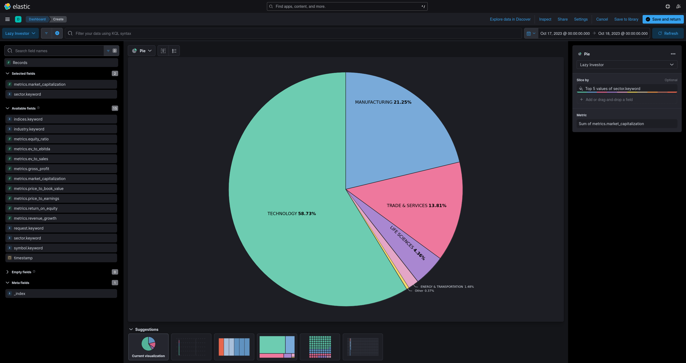
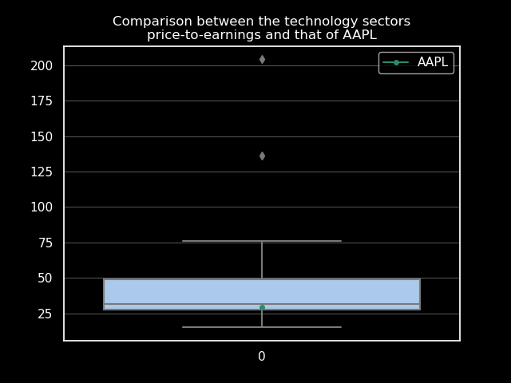
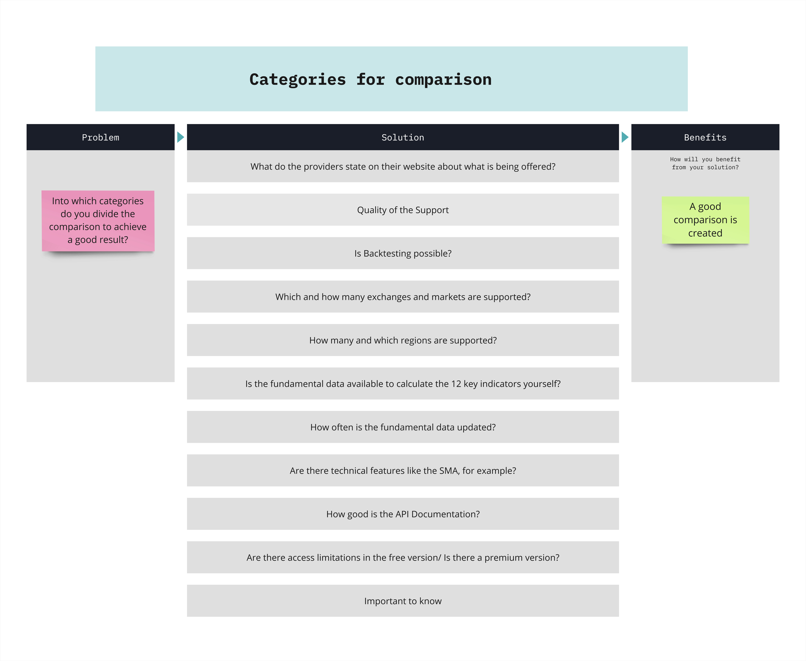
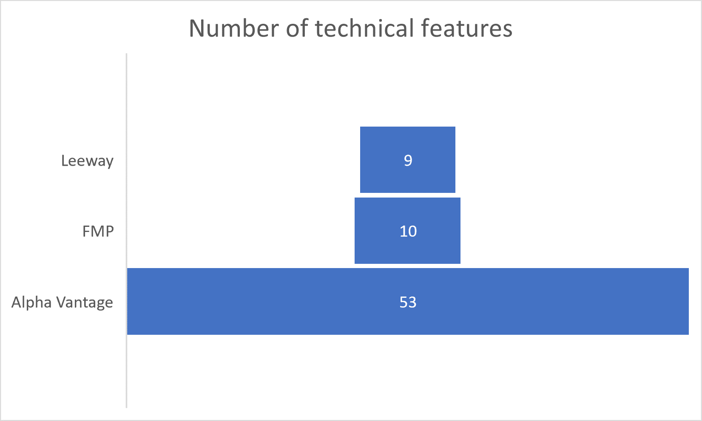

__Note:__ Some links can only be accessed in the universities' network (e.g. by connecting via the VPN).

# Infrastructure


## [Docker](https://www.docker.com/)
Docker is used to build and run Linux containers for multiple platforms, while Docker Compose is a tool for defining and managing multi-container applications. Together, they provide a powerful solution for containerization, making it easier to deploy and scale applications.

Our composed Docker application consists of 4 services:
- __Elasticsearch__ (Database)
- __Kibana__ (Frontend)
- __App__ (Logic)
- __Cron__ (Automation)

### Architecture


### [Dockerfile](https://docs.docker.com/engine/reference/builder/)
Contains instructions for building an image.

__FROM__ creates the (Debian) base image.\
__RUN__ executes commands on the OS. (E.g. setting the timezone)\
__ADD__ copies files and directories into the image. (E.g. code)\
__CMD__ defines what to do on start. (E.g. running a loop)

### [Compose file](https://docs.docker.com/compose/compose-file/03-compose-file/)
YAML file that defines the services used in the multi-container application. Therefore, you can use images directly or build from an existing Dockerfile.

The working directory (WORKDIR) is used as the python path (searched for imports instead of the parent directory) unless it is explicitly defined as an environment variable by `ENV PYTHONPATH=<path>`. \
The Elasticsearch data which is located at */usr/share/elasticsearch/data* on the guest machine will be persistently stored at */var/lib/docker/volumes/compose_elasticsearch_volume/_data* on the host machine.

### Networking
Docker Compose maintains a DNS that resolves the `container_name` property used in the [Docker Compose configuration](./compose/docker-compose.yml) to the relevant IP address.
When customizing ports, take a look at [this table](https://en.wikipedia.org/wiki/List_of_TCP_and_UDP_port_numbers) to avoid jam.

### Docker commands you should know:
Execute in the same directory as the [compose file](./docker/docker-compose.yml) as __root__.

- `docker compose build [--no-cache]` builds all containers [from new]
- `docker compose up [-d]` runs all containers [in background]
- `docker ps` lists running containers
- `docker exec -it <container name> bash` opens shell on the container

## [Elasticsearch](https://www.elastic.co/elasticsearch/)
Elasticsearch is a document-based database search engine that surpasses traditional (relational) databases for processing metrics due to its exceptional speed, scalability, and versatile search capabilities.
The stored documents, which are JSON objects are grouped into so called indeces. Those are comparable to tables. Mapping defines how fields may be used.
It provides a [REST API](https://de.wikipedia.org/wiki/Representational_State_Transfer) that you can send requests to through its HTTP interface.
That way you have different options to communicate with the database: 
1. Transferring data with [cURL](https://curl.se/)
2. Using the [Kibana console](http://139.6.56.155:5601/app/dev_tools#/console)
3. Using a programming languages library like the [python client](https://elasticsearch-py.readthedocs.io/en/v8.9.0/)
4. Saving and sending requests with [postman](https://www.postman.com/)

### Database design
While Elasticsearch can handle unstructured data, our use case is a scenario where a carefully chosen schema and mapping is beneficial to ensure data integretiy, search efficiency and ease of use.
```yaml
{
  # name of the index
  "lazy-investor": {
    # used to provide alternative names or references to the index
    "aliases": {},
    # defines the fields for the index by describing their data type and subfields
    "mappings": {
      "properties": {
        "indices": {
          "type": "text",
          "fields": {
            "keyword": {
              "type": "keyword",
              "ignore_above": 256
            }
          }
        },
        "industry": {
          "type": "text",
          "fields": {
            "keyword": {
              "type": "keyword",
              "ignore_above": 256
            }
          }
        },
        "metrics": {
          "properties": {
            "equity_ratio": {
              "type": "float"
            },
            "ev_to_ebitda": {
              "type": "float"
            },
            "ev_to_sales": {
              "type": "float"
            },
            "gross_profit": {
              "type": "long"
            },
            "market_capitalization": {
              "type": "long"
            },
            "price_to_book_value": {
              "type": "float"
            },
            "price_to_earnings": {
              "type": "float"
            },
            "return_on_equity": {
              "type": "float"
            },
            "revenue_growth": {
              "type": "float"
            }
          }
        },
        "request": {
          "type": "text",
          "fields": {
            "keyword": {
              "type": "keyword",
              "ignore_above": 256
            }
          }
        },
        "sector": {
          "type": "text",
          "fields": {
            "keyword": {
              "type": "keyword",
              "ignore_above": 256
            }
          }
        },
        "symbol": {
          "type": "text",
          "fields": {
            "keyword": {
              "type": "keyword",
              "ignore_above": 256
            }
          }
        },
        "timestamp": {
          "type": "date"
        }
      }
    },
    # contains various configurations for the index
    "settings": {
      "index": {
        "routing": {
          "allocation": {
            "include": {
              "_tier_preference": "data_content"
            }
          }
        },
        "number_of_shards": "1",
        "provided_name": "lazy-investor",
        "creation_date": "1697468673744",
        "number_of_replicas": "1",
        "uuid": "nq4OdF_wRF60M7VP2PDAKw",
        "version": {
          "created": "8090199"
        }
      }
    }
  }
}
```

### Sample document
```json
{
  "_index": "lazy-investor",
  "_id": "mtIWT4sBXRCDxZ8MO0Ai",
  "_version": 1,
  "_seq_no": 486,
  "_primary_term": 1,
  "found": true,
  "_source": {
    "symbol": "AAPL",
    "sector": "Technology",
    "industry": "Consumer Electronics",
    "ipo": "1980-12-12",
    "indices": [
      "DJI",
      "S5INFT",
      "IXCO",
      "OEX",
      "NDX",
      "SPX",
      "IXIC",
      "DJA"
    ],
    "metrics": {
      "revenue_growth": -0.014,
      "gross_profit": 170782000000,
      "return_on_equity": 1.6009,
      "equity_ratio": 0.1799019812677965,
      "gearing_ratio": 1.627086305869861,
      "market_capitalization": 2743176790016,
      "enterprise_value": 2789980241920,
      "ev_to_sales": 5.9171,
      "ev_to_ebitda": 23.52,
      "price_to_earnings": 29.3903,
      "price_to_book_value": 44.6301,
      "price_to_cashflow": 103.98698976557999
    },
    "timestamp": "2023-10-20T23:55:38.909939",
    "request": "STOCK_AAPL_US_LEEWAY"
  }
}
```

### Relevant HTTP request methods
__PUT__ replaces a ressource with the payload. \
__GET__ requests a representation of a ressource. \
__DELETE__ deletes a ressource. \
__POST__ submits an change of the ressource.

### Sample requests (CRUD and other useful ones)
```yaml
# create index
PUT lazy-investor

# map timestamp to date
PUT lazy-investor/_mapping
{
  "properties": {
    "timestamp": {
      "type": "date"
    }
  }
}

# show clusters
GET _cluster/health

# show nodes
GET _nodes/stats

# show db schema (as seen above)
GET lazy-investor

# delete index lazy-investor
DELETE lazy-investor

# show all documents
GET lazy-investor/_search

# create document (dynamic id)
POST lazy-investor/_doc/
{
  # data
}

# show specific document by id (as seen above)
GET lazy-investor/_doc/mtIWT4sBXRCDxZ8MO0Ai

# update specific field by id
POST lazy-investor/_update/mtIWT4sBXRCDxZ8MO0Ai
{
  "doc": {
    "industry": "Healthcare"
  }
}

# delete specific document by id (as seen above)
DELETE lazy-investor/_doc/mtIWT4sBXRCDxZ8MO0Ai

# search for symbol IBM
GET lazy-investor/_search
{
  "query": {
    "match": {
      "symbol": "IBM"
    }
  }
}

# search for stocks listed in S&P 500
GET lazy-investor/_search
{
  "query": {
    "bool": {
      "must": [
        {
          "match": {
            "indices": "SPX"
          }
        }
      ]
    }
  }
}

# search for minimum price to earnings of 100
GET lazy-investor/_search
{
  "query": {
    "range" : {
      "metrics.price_to_earnings": {
          "gte" : 100
      }
    }
  }
}

# search for documents created on 2023-10-14
GET lazy-investor/_search
{
  "query": {
    "range": {
      "timestamp": {
        "gte": "2023-10-14",
        "lt": "2023-10-15"
      }
    }
  }
}

# remove all documents belonging to request INDEX_NDX_ALPHA_VANTAGE
POST lazy-investor/_delete_by_query
{
  "query": {
    "match": {
      "request": "INDEX_NDX_ALPHA_VANTAGE"
    }
  }
}
```

### Security

To make the database more secure, you can set the security environment variable to true and assign a username and password.

```dockerfile
xpack.security.enabled: "true"
ELASTIC_USERNAME: "fabian"
ELASTIC_PASSWORD: "Pa$$w0rd"
```

## [Kibana](https://www.elastic.co/de/kibana)
Browser-based data visualization and analysis tool that is built on Elasticsearch and part of the [Elastic Stack](https://www.elastic.co/en/elastic-stack). The resulting visualizations can be saved and assigned to dashboards for monitoring and benchmarking purposes.

### Example: Proportionally market capitalization grouped by the top 5 sectors for the NASDAQ-100, collected on October 17th using Alpha Vantage



## App (Server)
Application logic procuring and transforming fundamental data.

__Excursus: [Tickersymbols](https://www.ig.com/en/glossary-trading-terms/stock-symbol-definition)__ \
Those abbreviations (usually 1-6 characters) identify stocks and indeces (mostly within one country). Thus, there may be different symbols for the same company or a company may be known under several symbols.

### [app.py](./docker/app/app.py)
Main program, whose `document()` function is called to receive index, market or stock data including metrics and general information.
Uses ss.py to retrieve basic data such as symbols needed for findata.py to receive financial data for an index or a market.

### [findata.py](./docker/app/findata.py)
Parses [multiple financial APIs](#api-comparison) to retrieve fundamental data and general information. Encapsulating (and caching) the data into objects provides a call-cost efficient way to calculate metrics.

### [ss.py](./compose/App/ss.py)
Uses a pretty neat API called [StockSymbol](https://github.com/yongghongg/stock-symbol/tree/master) to implement the generation of a JSON file that lists all stock symbols belonging to a given [index](./appendix/index_symbols.json) or [market](./appendix/market_symbols.json). This project saved us a lot of [scraping like we did last time](./archive/WI_Projekt_SS23_Juelich_Kalacevic/src/components.py). However, it should be mentioned that, as is usual with APIs, server failures can occur. That's why we use the files generated once as a backup. \
Attention: [Used *dr_market* instead of *de_market* in **market_list** attribute in case of german stocks](https://github.com/yongghongg/stock-symbol/issues/9).

### [interface.py](./compose/App/interface.py)
XML-RPC server for responding to HTTP requests from Clients with documents.
Enums cannot be used due to lack of encoding from XML. Therefore, their actual values must be used.

### tokens.py (not staged)
API-keys used for Alpha-Vantage, Financial Modeling Prep, Leeway and StockSymbol.

## Cron (Client)
[Service](https://wiki.ubuntuusers.de/Cron/) that enables scheduling the execution of bash commands. \
__Note:__ When working with cronjobs, it's important to explicitly set the timezone on that (virtual) machine.

### [crontab](./docker/cron/crontab)
Table that lists cronjobs specifying the minute, hour, day, month and weekday a command should be executed. They are either system wide or user related. \
`0 0 * * *` defines the daily execution of the script.

### [cronjob.py](./docker/cron/cronjob.py)
Implements a XML-RPC client that requests findata from the applications interface and stores it in the database via HTTP request.

##
__Shared__\
Api and Sort Enum.

# Usage
`interface.py`
```python
def metrics(sort: int, symbols: str, country_codes: str, api: int)
```
```
sort        symbols country_codes api
SORT.INDEX     1..*             0   1
SORT.MARKET       0          1..*   1
SORT.STOCK     1..*             1   1
```

## Analysis
Once you have collected enough data to form a meaningful picture of e.g. an index or a time period, you can [perform analysis](./appendix/results/boxplot.py).

__Sample:__
Comparing a single stock's P/E ratio to that of its sector helps investors measure the stock's relative valuation and growth perspective and guides on when to buy or sell. It also assists in diversification and risk management, ensuring a well balanced investment portfolio.



#
# API-Comparison
## Introduction

### The Problem

In today's interconnected world, access to real-time and reliable financial data plays a crucial role for businesses, investors, and developers. Integrating financial data into applications, trading strategies, or business decisions requires the use of financial APIs. These interfaces provide access to a large pool of information, including stock prices, financial reports, economic indicators, and more.

However, as there are many providers in the market, comparing these options is crucial. This comparison not only aims to select the best provider but also impacts the efficiency of trading strategies, the accuracy of financial reports, and ultimately, business success. This project aims to compare the leading financial API providers, namely Alpha Vantage, Financial Modeling Prep (FMP), and Leeway. We will analyze their offerings, technical features, documentation, access limitations, and costs to determine which provider best aligns with specific requirements.

Through this comparison, we can gain an understanding of how these providers contribute to informed financial decisions and the optimization of trading strategies. Choosing the right financial data API provider can significantly impact success in the financial world, and this comparison aims to simplify the decision-making process.

### Solution Overview

In this comprehensive comparison, we explore a range of critical aspects of financial data API providers. Our selection of these specific evaluation points is based on our previous project, where we extensively used an API to calculate 12 Key Indicators. During the course of that project, it became evident that these very points, which we now compare, play a highly relevant role in the selection of a financial data API for any analytical or trading intend.

By looking into these areas, we aim to empower users with the insights needed to make well-informed decisions when selecting a finance API. These key factors serve as a compass for users, guiding them toward a provider that aligns with their data requirements and trading strategies.

## Methodology 

The approach in this project was as follows:

-  Selection of API Providers: Identified three API providers, namely Financial Modeling Prep (FMP), Alpha Vantage, and Leeway, for comparison.
- Comparision Criteria: Defined a set of criteria for the comparison, including what the providers offer, the quality of support, backtesting capabilities, markets and regions supported, update frequency, availability of fundamental data, technical features, API documentation quality, and the presence of premium versions.
- Evaluation of Criteria: Assessed each API provider based on the defined criteria, gathering information on their offerings, support quality, features, and more.
- Quantitative Analysis: Quantified certain aspects, such as API call limits, update frequency, and costs, to provide numerical comparisons.
- Contextual Analysis: Provided context and explanations for each criterion to help readers understand the significance and implications of the findings.
- Visualization: Utilized visual aids, such as tables and charts, to present data and comparisons in a more reader-friendly manner.
- Discussion: Facilitated a discussion around the findings, highlighting the strengths and weaknesses of each API provider.
- Conclusion: Summarized the findings, emphasizing which provider excels in specific areas and how the selection of an API provider should align with users' needs.

## Approach




## Results

### What do the providers state on their website about what is being offered?

[__Alpha Vantage__](https://www.alphavantage.co/)

- Realtime & historical stock market data APIs
- Forex, commodity & crypto data feeds
- 60+ technical & economic indicators
- Market news API & sentiments
- Global coverage


[__Financial Modeling Prep__](https://site.financialmodelingprep.com/developer/docs/pricing/)

- Financial statements and multiple metrics for over 30,000 companies across the world
- Stock prices and profile for more than 40,000 symbols
- News and press realeses in real-time categorized by stock symbol
- Multiple economic data like inflation rates, GDP, economic calendar and more
- Many ready to use packages for multiple languages.
- Social sentiment across different social media like Twitter or Reddit
- Insider trading for U.S. stocks gathered from SEC forms
- Processed 13-F forms, mutual fund holders and insitutional holders
- SEC filings, transcripts, etf holders, earnings calendar and many more.


[__Leeway__](https://leeway.tech/data-api)

- Provides access to comprehensive financial data from over 50 exchanges worldwide. (Among others, in Germany, there are Xetra and Frankfurt Stock Exchange, the Euronext exchanges in Paris and Amsterdam, and of course, in the USA, including New York Stock Exchange (NYSE) and NASDAQ.)
- fundamental data, including annual and quarterly financial statement data with up to 20 years of history, closing prices with the complete historical record, interval price data, and much more.
- Stocks, ETFs, indices, funds, currencies, and cryptocurrencies. For stocks and ETFs, also master data, and for stocks, fundamental data as well.
- Price data API, Fundamental data API, live delayed prices, interval price data, forex, crypto, and commodities, funds & ETF API, bonds, macroeconomic data, event calendar, event history.


### Quality of the Support:

To test the response time and quality of support, a test email was composed and sent to the four providers. FMP and Leeway provided a reasonable and satisfactory response. There was no response from Alpha Vantage.

__Email for Support Test:__

Subject: API Support Responsiveness

Dear …,

We are currently evaluating various Finance/Stock API providers for a project I am working on. As part of this evaluation, I wanted to test the responsiveness of your support team. \
Could you please confirm the receipt of this email by replying to it? This will help me determine the efficiency of your support system and give me confidence in considering your API services for integration. \
Thank you for your time and attention. I look forward to your response.

Best regards,


### Is Backtesting possible?

Backtesting involves applying a strategy or predictive model to historical data to determine its accuracy.
It allows traders to test trading strategies without the need to risk capital.
Common backtesting measures include net profit/loss, return, risk-adjusted return, market exposure, and volatility. \
The time period for backtesting with a financial APIs depends on the specific trading or investment strategy and the data you need for the analysis. There isn't a one-size-fits-all answer to how far back the historical data should go, as it can vary based on factors such as your trading frequency, asset class, and the nature of your strategy. \
In this case the answer is still easy because if you wanted to backtest with the 12 Stock key figures we calculated in the last Project, it would not be possible to calculate for example, the Price to Earning with Alpha Vantage, because they only provide the current EPS in the Company Overview. Also the fundamentaldata only goes back to 2018. \
FMP provides 15+ years of Financial Statements, including international filings. \
Leeway provides fundamental data back up to 30 years and the historical prices of up to 100 years.

Having access to such extensive historical data allows for more in-depth and comprehensive backtesting of strategies. Traders and investors often rely on long-term historical data to analyze the performance of their strategies under various market conditions and economic cycles. Therefore, FMP and Leeway would be better suited for backtesting purposes when compared to Alpha Vantage, especially if you require a longer historical perspective for your analysis.


### Which and how many exchanges and markets are supported?


Everything that is in these tables was taken as it was provided.

__Leeway:__

| Symbol | Description |
| --- | --- |
| AS | Euronext Amsterdam |
| AU | Australia Exchange |
| BK | Thailand Exchange |
| BOND | Bonds |
| BR | Euronext Brussels |
| BSE | Bombay Exchange |
| BUD | Budapest Stock Exchange |
| CC | Crypto-Currencies |
| CO | Coppenhagen Exchange |
| COMM | Commodities & Futures |
| DU | Dusseldorf Exchange |
| EUFUND | Europäische Fonds |
| F | Frankfurt Exchange |
| FOREX | Forex |
| GBOND | Governement Bonds |
| HE | Helsinki Exchange |
| HK | Hong Kong Exchange |
| HM | Hamburg Exchange |
| IC | Iceland Exchange |
| INDX | Indices |
| IS | Istanbul Stock Exchange |
| JK | Jakarta Exchange |
| KAR | Karachi Stock Exchange |
| KLSE | Kuala Lumpur Exchange |
| KQ | KOSDAQ |
| LS | Euronext Lisbon |
| LSE | London Exchange |
| MC | Madrid Exchange |
| MCX | MICEX Russia |
| MI | Borsa Italiana |
| MU | Munich Exchange |
| MX | Mexican Exchange |
| NASDAQ | NASDAQ |
| NFN | Nasdaq First North |
| NYSE | NYSE |
| OL | Oslo Stock Exchange |
| PA | Euronext Paris |
| SA | Sao Paolo Exchange |
| SG | Singapore Exchange |
| SHE | Shenzhen Exchange |
| SHG | Shanghai Exchange |
| SR | Saudi Arabia Exchange |
| ST | Stockholm Exchange |
| SW | SIX Swiss Exchange |
| TA | Tel Aviv Exchange |
| TO | Toronto Exchange |
| TSE | Tokyo Stock Exchange |
| TW | Taiwan Exchange |
| VI | Vienna Exchange |
| VN | Vietnam Stocks |
| XETRA | XETRA |

__Financial modeling prep:__

| Symbol | Description |
| --- | --- |
| ATH | Athens Stock Exchange  |
| ASX | Australian Stock Exchange  |
| BER | Berlin Stock Exchange  |
| BSE | Bombay Stock Exchange  |
| IST | Borsa Istanbul  |
| BUD | Budapest Stock Exchange  |
| BUE | Buenos Aires Stock Exchange  |
| CSE | Canadian Securities Exchange  |
| CBOT | Chicago Board of Trade  |
| CME | Chicago Mercantile Exchange  |
|  | Currency Rates |
|  | Deutsche Boerse XETR |
|  | Dow Jones Indexes |
| DUS | Dusseldorf Stock Exchange  |
| EGX | Egyptian Stock Exchange  |
|  | Euronext |
|  | Euronext Amsterdam |
|  | Euronext Brussels |
|  | Euronext Dublin |
|  | Euronext Lisbon |
| PAR | EURONEXT Paris  |
| FSX | Frankfurt Stock Exchange  |
|  | FTSE Indices |
| HAM | Hamburg Stock Exchange  |
| HKEX | Hong Kong Stock Exchange  |
| IDX | Indonesia Stock Exchange  |
| JSE | Johannesburg Stock Exchange  |
| KOE | Korea Exchange  |
| KOSDAQ | Korea Exchange  |
|  | London Stock Exchange |
|  | Madrid SE C.A.T.S. |
|  | Malaysian Stock Exchange |
| BMV | Mexico Stock Exchange  |
| MIL | Milan Stock Exchange  |
| MOEX | Moscow Exchange  |
| MUN | Munich Stock Exchange  |
| CPH | NASDAQ Copenhagen  |
| HEL | NASDAQ Helsinki  |
|  | Nasdaq Stock Exchange |
| NSE | National Stock Exchange of India  |
| NEO | NEO Exchange  |
| COMEX | New York Commodities Exchange  |
| NYSE | New York Stock Exchange  |
| NZE | New Zealand Stock Exchange  |
| OSE | Oslo Stock Exchange  |
| OTC | OTC Markets US  |
| PRA | Prague Stock Exchange  |
| QE | Qatar Stock Exchange  |
| SGO | Santiago Stock Exchange  |
| BOVESPA | Sao Paulo Stock Exchange  |
| Tadawul | Saudi Stock Exchange  |
| SHH | Shanghai Stock Exchange  |
| SHZ | Shenzhen Stock Exchange  |
| SGX | Singapore Stock Exchange  |
| SET | Stock Exchange of Thailand  |
| STO | Stockholm Stock Exchange  |
| STU | Stuttgart Stock Exchange  |
| SIX | Swiss Stock Exchange  |
| TWSE | Taiwan Stock Exchange  |
| TASE | Tel Aviv Stock Exchange  |
| TAL | The Nasdaq Tallinn AS  |
| TSE | Tokyo Stock Exchange  |
| TSX | Toronto Stock Exchange  |
| TSXV | TSX Venture Exchange  |
|  | Vienna Stock Exchange |

__Alpha Vantage:__

| Symbol | Description |
| --- | --- |
|  | NASDAQ |
|  | London Stock Exchange |
|  | Toronto Stock Exchange |
|  | Toronto Venture Exchange |
|  | XETRA |
|  | BSE |
|  | Shanghai Stock Exchange |
|  | Shenzhen Stock Exchange |

### How many and which regions are supported?


| Leeway | FMP | Alpha Vantage |
| --- | --- | --- |
| Europe | Europe | Europe |
| North America | North America | North America |
| South America | South America | Asia |
| Australia | Australia |  |
| Asia | Asia |  |
|  | Africa |  |


### Is the fundamental data available to calculate the 12 key indicators yourself?
This table presents the indicators we calculated ourselves in the last project in the 'Indicator' column. In the other columns, you can see the three API providers and the respective names of the keys required for the calculations. These names are underlined for better readability. This table is intended to verify whether it is possible to calculate the derived metrics with each of the API providers


| Indicator | Alpha Vantage | FMP | Leeway |
| --- | --- | --- | --- |
| Revenue Growth  = (Current Period Revenue - Prior Period revenue) / Prior period revenue | <ins>totalRevenue</ins> (Income Statement) | <ins>revenue</ins> (Income Statement) | <ins>totalRevenue</ins> (Fundamentals → Income Statement) |
| Gross Profit = Revenue – Cost of Revenue | <ins>totalRevenue</ins> (Income Statement) - <ins>costOfRevenue</ins> (Income Statement) | <ins>revenue</ins> (Income Statement) - <ins>costOfRevenue</ins> (Income Statement) | <ins>totalRevenue</ins> (Fundamentals → Income Statement) - <ins>costOfRevenue</ins> (Fundamentals → Income Statement) |
| ROE = Net Income / Shareholders' Equity | <ins>netIncome</ins> (Income Statement) / <ins>totalShareholderEquity</ins> (Balance Sheet) | <ins>netIncome</ins> (Income Statement) / <ins>totalStockholdersEquity</ins> (Balance Sheet) | <ins>netIncome</ins> (Fundamentals → Income Statement) / <ins>totalStockholdersEquity</ins> (Fundamentals → Balance Sheet) |
| Equity Ratio = Shareholder's Equity / (Liabilities + Shareholders' Equity) |  <ins>totalShareholderEquity</ins> (Balance Sheet) / (<ins>totalLiabilities</ins> (Balance Sheet) + <ins>totalShareholderEquity</ins> (Balance Sheet)) | <ins>totalStockholdersEquity</ins> (Balance Sheet)    / (<ins>totalLiabilities</ins> (Balance Sheet) +   <ins>totalStockholdersEquity</ins> (Balance Sheet)) |  <ins>totalStockholdersEquity</ins> (Fundamentals → Balance Sheet) / (<ins>totalLiab</ins> (Fundamentals → Balance Sheet) + <ins>totalStockholdersEquity</ins> (Fundamentals → Balance Sheet)) |
| Gearing = Total Debt / Total Shareholders' Equity | <ins>longTermDebtNoncurrent</ins> (Balance Sheet) / <ins>totalShareholderEquity</ins> (Balance Sheet) | <ins>longtermdebtnoncurrent</ins> (Balance Sheet as Reported) / <ins>totalStockholdersEquity</ins> (Fundamentals → Balance Sheet) | <ins>longTermDebt</ins> (Fundamentals → Balance Sheet) / <ins>totalStockholdersEquity</ins> (Fundamentals → Balance Sheet) |
| Market Capitalization = Current Market Price per share * Total Number of Outstanding Shares | <ins>Close</ins> (Time Series Intraday) * <ins>SharesOutstanding</ins> (Company Overview) | <ins>Close</ins> (1min historical stock prices with volume) * <ins>weightedaveragenumberofdilutedsharesoutstanding</ins>(financial statement full as reported) | <ins>Close</ins> (Intraday) * <ins>SharesOutstanding</ins>( Fundamentals → SharesStats) |
| EV = market capitalization + total debt - cash and cash equivalents | <ins>Market Capitalization</ins> + <ins>longTermDebtNoncurrent</ins> (Balance Sheet) - <ins>cashAndCashEquivalentsAtCarryingValue</ins> (Balance Sheet) | <ins>Market Capitalization</ins> + <ins>longtermdebtnoncurrent</ins> (Balance Sheet as Reported) - <ins>cashandcashequivalentsatcarryingvalue</ins> (balance sheet as reported) | <ins>Market Capitalization</ins> + <ins>longTermDebt</ins> (Fundamentals → Balance Sheet) - <ins>cashAndEquivalents</ins> (Fundamentals → Balance Sheet) |
| EV/R = EV / Total Revenue | <ins>EV</ins> / <ins>otalRevenue</ins> (Income Statement)  | <ins>EV</ins> / <ins>revenue</ins> (Income Statement) | <ins>EV</ins> / <ins>totalRevenue</ins> (Fundamentals → Income Statement) |
| EBITDA = Income Tax Expense+ Interest Expense + Net income + Depreciation and Amortization | <ins>incomeTaxExpense</ins> (Income Statement) + <ins>interestExpense</ins> (Income Statement) + <ins>netIncome</ins>(Income Statement) + <ins>depreciationAndAmortization</ins> (Income Statement) | <ins>incomeTaxExpense</ins> (Income Statement) + <ins>interestExpense</ins> (Income Statement) + <ins>netIncome</ins> (Income Statement) + <ins>depreciationAndAmortization</ins> (Income Statement) | <ins>IncomeTaxEspense</ins> (Fundamentals → Income Statement) + <ins>InterestExpense</ins> (Fundamentals → Income Statement) + <ins>netIncome</ins> (Fundamentals → Income Statement) + <ins>deprecationAndAmortization</ins> (Fundamentals → Income Statement) |
| EV/EBITDA = EV / EBITDA | <ins>EV</ins> / <ins>EBITDA</ins> | <ins>EV</ins> / <ins>EBITDA</ins> | <ins>EV</ins> / <ins>EBTIDA</ins> 
| P/E = Stock Price / Earnings Per Share | <ins>Close</ins> (Time Series Intraday) / <ins>EPS</ins> (Company Overview) | <ins>Close</ins> (1min historical stock prices with volume) / <ins>earningspersharebasic</ins> (financial statement full as reported) | <ins>Close</ins> (Intraday) / <ins>EarningsShare</ins> (Fundamentals → Highlights) |
| P/B = Stock Price / (total shareholder equity / Shares outstanding) | <ins>Close</ins> (Time Series Intraday) / <ins>SharesOutstanding</ins> (Company Overview) | <ins>Close</ins> (1min historical stock prices with volume) / <ins>weightedaveragenumberofdilutedsharesoutstanding</ins> (financial statement full as reported) | <ins>Close</ins>(Intraday) / <ins>SharesOutstanding</ins>( Fundamentals → SharesStats) |
| P/CF = Stock Price / (Operating Cash Flow / Shares Outstanding) | <ins>Close</ins> (Time Series Intraday) / (<ins>operatingCashflow</ins> (Cash flow) / <ins>SharesOutstanding</ins> (Company Overview)) | <ins>Close</ins> (1min historical stock prices with volume) /(<ins>operatingCashFlow</ins> (Cash flow) / <ins>weightedaveragenumberofdilutedsharesoutstanding</ins> (financial statement full as reported)) | <ins>Close</ins> (Intraday) / (<ins>totalCashFromOperatingActivities</ins> (Fundamentals → Cash Flow) / <ins>sharesOutstanding</ins>( Fundamentals → SharesStats)) |

### How often is the fundamental data updated?

To get an reliable answer to that, we asked the API providers themselves.

**FMP**: FMP updates its Financial Statement endpoint after a few minutes/hours of data being published on the SEC for US companies. For international filings, updates occur daily. These updates are frequent and aim to provide near-real-time data for US companies. \
**Leeway**: Leeway updates its data daily, but there might be a slight delay after the release of earnings reports. The update timing can vary based on factors like the size of the company, how quickly they publish their reports, and market conditions. Similar to FMP, Leeway provides daily updates with potential delays for earnings reports. \
**Alpha Vantage**: Alpha Vantage's data is generally refreshed on the same day a company reports its latest earnings and financials. While they did not  respond to the E-Mail, it is stated on their website, this indicates a daily update frequency, similar to FMP and Leeway.

In summary, all three API providers aim to offer daily data updates, which is a standard practice in the financial data industry. Whether you need near-real-time updates (FMP) or daily data updates (Leeway, Alpha Vantage).

### Are there technical features like the SMA, for example?

Technical features are used in the Technical Analysis of Stocks and the Technical Analysis is the study of historical market data, including price and volume.

- Technical analysis attempts to predict future price movements, providing traders with the information needed to make a profit.
- Traders apply technical analysis tools to charts in order to identify entry and exit points for potential trades.
- An underlying assumption of technical analysis is that the market has processed all available information and that it is reflected in the price chart.

Alpha Vantage provides a wide variety of technical features. There are [53 Technical features available](https://www.alphavantage.co/documentation/#technical-indicators), these include, for example, the SMA, EMA, WMA, etc.

FMP provides [9 Technical Indicators in the Technical Indicators Intraday API](https://site.financialmodelingprep.com/developer/docs/technicals-intraday-api/), and [1 more in Chart Market Stock Data API](https://site.financialmodelingprep.com/developer/docs/historical-stock-data-free-api/). So in total, there are only 10 Technical Indicators that FMP provides.

Leeway provides 9 Technical Indicators that are listed in the big JSON file that they output in /api/v1/public/historicalquotes/marketcap/{symbolExchange} [in the Fundamentals](https://leeway.tech/api-doc/general?lang=ger&dataapi=true).




### How good is the API Documentation?

FMP stands out with its exceptional API documentation. They offer an extensive range of financial-related data, comprehensively categorized into their respective areas, accompanied by detailed explanations. Additionally, FMP provides a valuable resource by offering a page containing individual [formulas](https://site.financialmodelingprep.com/developer/docs/formula) for various financial ratios, which greatly aids developers and users. The documentation also includes language-specific guides to enhance usability. \
A standout feature of FMP's documentation is its provision of property listings for Financial Reports, including Income Statements, Balance Sheets, and Cash Flow. This unique feature saves users the hassle of having to make API calls first to determine whether specific values are available. \
In summary, FMP's API documentation sets a high standard, offering comprehensive data, formula references, and convenient property listings, making it a top choice for users seeking detailed and user-friendly financial data resources.

    Since FMP has made changes to its website, here is a new evaluation of the documentation:
    The new documentation for FMP retains its organizational structure and categories from the previous version. However, there are notable changes. Descriptions for various sections have been streamlined and are now somewhat shorter, providing concise information.
    One significant change is the removal of the functionality that allowed users to click on listed items, such as Financial Statements, to access a separate page detailing the properties of financial reports. Instead, users are presented with a clear guide showing the parameters that can be utilized for each respective statement. It's important to note that these parameter descriptions serve as a reference for users to understand the available options for customization but are not directly usable values.
    An aspect that may pose a minor inconvenience is the scrolling behavior. When the mouse cursor is positioned within the statement display, scrolling is limited to within the statement itself, making it less intuitive to navigate the entire webpage.
    Despite these minor drawbacks, FMP continues to offer the most comprehensive and detailed API documentation among the available options.
>   [Here is a link to the new documentation](https://site.financialmodelingprep.com/developer/docs)


[Alpha Vantage's API documentation](https://www.alphavantage.co/documentation/), while comprehensive, has some notable differences compared to FMP's documentation. While it provides categorized information with descriptions and examples for various parameters, it offers a more limited range of data compared to FMP. \
One area where Alpha Vantage falls short is in providing formulas that explain how the ratios are composed or calculated. This can be a disadvantage for users who want a deeper understanding of the financial metrics they are working with. \
However, Alpha Vantage does offer language-specific guides for the API, which can be helpful for developers working in different programming languages. \
One notable distinction is that Alpha Vantage's documentation lacks an upfront overview of what is listed in the respective documents. This means that users may need to make API calls to explore the available data, which can be less convenient compared to FMP's approach of providing an upfront overview of data properties. \
In summary, Alpha Vantage's API documentation is comprehensive but lacks certain features and detailed formulas found in FMP's documentation. Users may need to make API calls to explore the available data fully.

[Leeway's API documentation](https://leeway.tech/api-doc/general?lang=ger&dataapi=true) is notably less user-friendly compared to other providers. The design and presentation of the documentation can be a drawback. Leeway's documentation uses URL endpoint resources, which might lead to confusion when users are trying to find specific information. \
While Leeway categorizes information into respective areas like other APIs, the design can be challenging to navigate, especially for users new to the API. However, it does offer a brief description for each endpoint, which is well done and provides some guidance. \
One positive aspect of Leeway's documentation is its capability to allow users to pass the exchange directly in the request, which can be a convenient feature for those looking to access exchange-specific data. \
Despite these attributes, Leeway's documentation lacks detailed formulas explaining metrics and financial ratios, and it also doesn't offer an upfront overview of what is available in the fundamentals, which could be useful for users seeking a quick reference. \
In summary, Leeway's API documentation may require users to spend more time navigating and exploring the documentation compared to other providers, and it lacks certain features found in more user-friendly documentation.


### Are there access limitations in the free version/ Is there a premium version?

Each of the three API providers has premium versions of their API, along with limitations in the free version.

For Financial Modeling Prep, there are four different versions available:

1. Free: Provides access only to the US market, allows 250 requests per day, no access to premium endpoints, a maximum limit of 5 for all endpoints, and access to only annual data.
2. Starter for $19/month: Offers 100% market coverage, allows 300 API requests per minute, provides 30 years of historical data, and can be canceled at any time.
3. Professional for $49/month: Also provides 100% market coverage, allows 750 API requests per minute, grants access to premium endpoints, offers 30 years of historical data, includes chat and email priority support, bulk download endpoints, WebSocket, and can be canceled at any time.
4. Enterprise for $99/month: Offers 100% market coverage, 1,500 calls/minute, access to premium endpoints, 30 years of historical data, is allowed for commercial use (unlike the others), includes chat and email priority support, a 99.95% uptime SLA, bulk endpoints, stock ownership endpoints, WebSocket, and can also be canceled at any time.

        FMP has since changed the prices and names of the services as follows:

        Basic:
            5 API Calls/Min.   
            5-Year Historical Data.
            Fundamental and Market Data.
            Free.

        Starter:
            Real-time Data
            300 API Calls / Min
            30+ Year Historical Data
            Fundamental Data
            Market Data
            $29.00/mo.
        
        Premium:
            Real-time Data
            750 API Calls / Min
            30+ Year Historical Data
            Fundamental Data
            Market Data
            Advanced Data
            Websocket
            Corporate Filings
            $69.00/mo.

         Ultimate:
            Real-time Data
            3,000 API Calls/Min
            30+ Years Historical Data
            Fundamental Data
            Market Data
            Advanced Data
            Corporate Filings
            Fund & ETF Data
            ESG Data
            Websocket
            Bulk and Batch Deliver
            $139.00/mo.

For Leeway there are 2 different versions available:

1. A Free and a Premium version for 79,95€/month, but the only difference here is the number of requests available.
2. The Free Plan offers only 50 requests per day, while the Premium version provides 100,000 requests per day. Both versions offer access to over 40 global exchanges, 25,000+ global stocks, and historical data of up to 20 years for fundamental data. For End-of-Day data, it's the same, except for historical data where the complete history is provided.

For Alpha Vantage there are 3 different versions available:

1. There is a Free version that covers the majority of the datasets for up to 5 API requests per minute and 100 requestes per day.
2. An Acadameic version called “Academic Access”.
3. And a Premium version with several different payment plans:
- 30 API requests per minute + 15-minute delayed US market data for $24,99/month
- 75 API requests per minute + 15-minute delayed US market data: $49,99/month
- 150 API requests per minute + realtime US market data: $99,99/month
- 300 API requests per minute + realtime US market data: $149,99/month
- 600 API requests per minute + realtime US market data: $199,99/month
- 1200 API requests per minute + realtime US market data: $249,99/month

__Costs per API request__

Financial Modeling Prep (Old Version):

    Basic (Free):
        Cost per API Request: Unlimited, as it's free

    Starter ($19/Month):
        Cost per API Request: Approximately $0.0000633 (per API request at maximum usage)

    Professional ($49/Month):
        Cost per API Request: Approximately $0.0000653 (per API request at maximum usage)

    Enterprise ($99/Month):
        Cost per API Request: Approximately $0.0000667 (per API request at maximum usage)

Financial Modeling Prep (New Version):

    Starter ($29/Month):
        Cost per API Request: Approximately $0.0000967 (per API request at maximum usage)

    Premium ($69/Month):
        Cost per API Request: Approximately $0.000092 (per API request at maximum usage)

    Ultimate ($139/Month):
        Cost per API Request: Approximately $0.0000463 (per API request at maximum usage)

  Leeway:

    Free:
        Cost per API Request: Unlimited, as it's free

    Premium (75.95€/Month):
        Cost per API Request: Approximately 0.0007595€ (per API request at maximum usage)

Alpha Vantage:

    Free:
        Cost per API Request: Unlimited, as it's free

    Premium Plans:
        The cost per API request varies depending on the plan, ranging from approximately $0.0000833 to $0.0004167 per API request at maximum usage.


## Discussion
Alpha Vantage excels in providing a wide range of technical features, making it an attractive choice for users interested in technical analysis of stocks. However, it's essential to acknowledge several shortcomings.
One of the most notable drawbacks is the lackluster support and responsiveness of the customer support. Users often rely on responsive and helpful customer support teams, but Alpha Vantage falls short in this aspect. When assistance is needed, the unresponsiveness of their support can be a source of frustration.
Moreover, Alpha Vantage's market coverage is relatively small compared to some other providers. It also covers the least amount of regions. This limitation restricts users' ability to access a diverse array of exchanges and markets, potentially constraining their trading and investment strategies. 
Regarding data updates, data is generally refreshed on the same day a company reports its latest earnings. While this is acceptable for many users, some might prefer even faster updates provided by other platforms.Additionally, the lack of an extensive historical data set makes backtesting difficult. The relatively short supported time period can hinder users who rely on historical data to assess the performance of their trading strategies. While the documentation provided by Alpha Vantage is decent, it doesn't match the comprehensive level offered by other providers, such as Financial Modeling Prep.
Lastly, the premium pricing options are on the higher side, with the most expensive plan costing nearly $250 per month. This cost may not be justifiable for some users, especially considering that it offers fewer API calls per minute compared to other providers like FMP for a lower price.

Leeway on the other hand is an excellent choice for useres who prioritize the convenience of accessing extensive financial data within a single document. The standout feature is Leeway's commitment to providing comprehensive information in a single, well-organized JSON file.
Another good feature about Leeway was the quick and efficient response of the support team.
Backtesting capabilities are another strong suit for Leeway, thanks to its provision of fundamental data, dating back up to 30 years and historical price data spanning up to 100 years. This extensive historical perspective enables traders and investors to conduct in-depth and comprehensive analyses of their strategies.
They also provide a considerable amount of exchanges and markets, while not as extensive as FMP, the coverage is still impressive and should meet the needs of many users. The same applies to the regions. Leeway offers daily data updates with a small delay, depending on the company's size, to ensure that users have access to current and relevant financial information. However, there are still some notable limitations, especially when it comes to the technical features.
They offer the fewest amount of technical indicators compared to its competitors. FOr users who rely heavily on technical analysis, this can be a significant drawback.
Leeways worst feature is the documentation. It lacks the user-friendliness and organization seen in other providers Navigating the documentation, especially for new users, can be challenging, impacting the overall experience.
Unklike the other API providers, Leeway offers only one premium version, limiting users' choices. When evaluating the cost per API request, Leeway emerges as the most expensive option, which could have an impact on the decision of budget-conscious users.

FMP has an amazing customer support, offering quick responses and directly providing useful information. Backtesting is possible, although the data doesn't go as far back as Leeway's, with 15+ years, which is still sufficient for most users.
They support the largest number of exchanges/markets and regions, providing extensive coverage for various needs. Data is updated most frequently among the three providers, ensuring users have access to current financial information. For US companies, financial data is updated within a few minutes/hours of being published on the SEC, and for international filings, daily updates are available. The API documentation is exceptional, offering a very detailed and user-friendly resource with a large pool of financial-related data. FMP provides four premium versions, with the most expensive one priced at $139.00 per month, which may seem expensive at first glance, but it offers a substantial 3,000 API calls per minute. However, when calculating the cost per API request for the top premium versions of all providers, FMP emerges as the most cost-effective option.
One downside to FMP is the lackluster technical features, which are similar to Leeway. Additionally, while the documentation is excellent due to its comprehensive nature, it might be overwhelming for new users, given its extensive content and how it's divided into respective parts.

## Conclusion
In today's fast-evolving world of financial data, choosing the right API provider for your specific purposes is a crucial decision for traders, investors, and financial analysts. Our comparison of the three providers has revealed their respective strengths, weaknesses, and offerings, making it easier for users to find the perfect fit for their specific needs.

- Alpha Vantage: If your primary focus is on technical analysis, Alpha Vantage stands out with its comprehensive range of technical features. Traders seeking advanced tools to support their strategies will find a valuable resource in this provider.

- Financial Modeling Prep: FMP offers a huge variety of financial features, making it the ideal choice for those looking for a wide variety of data to support their decision-making processes. Additionally, FMP's updated and user-friendly documentation adds to its appeal.

- Leeway: Leeway sets itself apart with its capacity to provide extensive data all at once, in a convenient and comprehensive format. For users who require complete data sets in a single file, Leeway emerges as an excellent choice.

The key takeaway from this comparison is that each provider excels in specific domains. Alpha Vantage is the go-to choice for technical analysis enthusiasts, FMP offers a wide range of financial features and impressive documentation, while Leeway provides an all-in-one data solution that simplifies data access. Ultimately, the decision of which provider to choose will depend on your unique requirements and the specific goals you aim to achieve. By understanding the strengths of each provider, you can make a well-informed decision and leverage the financial data that best suits your needs.

### Important to know:
- If you call the Fundamentals in Leeway, it counts as 10 API calls at once.
- Leeway provides all the Fundamental data within the 10 API calls at once.
- Alpha Vantage uses their own Symbols for other exchanges.