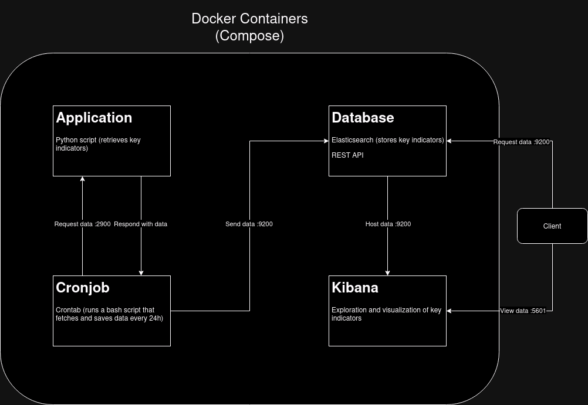

# Database

__Notes:__
- Some links can only be accessed in the universities' network (e.g. by connecting via the VPN)
- When customizing ports, take a look at [this table](https://en.wikipedia.org/wiki/List_of_TCP_and_UDP_port_numbers) to avoid jam

## Docker

### Docker commands you should know:
(execute on the same level as the [config file](./compose/docker-compose.yml))
- `docker compose build [--no-cached]` builds all containers
- `docker compose up [-d]` runs all containers
- `docker ps` lists running containers
- `docker exec -it \<container name\> bash` opens shell on the container

## Elasticsearch
Elasticsearch is a document-based database search engine that provides a [REST API](https://de.wikipedia.org/wiki/Representational_State_Transfer) that you can send requests to through its HTTP interface.
That way you have different options to communicate with the database: 
1. Transferring data with [cURL](https://curl.se/)
2. Using the [Kibana console](http://139.6.56.155:5601/app/dev_tools#/console)
3. Using a programming languages library like the [python client](https://elasticsearch-py.readthedocs.io/en/v8.9.0/)
4. Saving and sending requests with [postman](https://www.postman.com/)

The indices' data which is located at */usr/share/elasticsearch/data* on the guest machine will be persistently stored at */var/lib/docker/volumes/compose_elasticsearch_volume/_data* on the host machine.

lazy-investor index-id: kOm2aG-gTj2Wa-CaIRRFMw

## Cronjob
When working with cronjobs, it's important to explicitly set the timezone on that machine.

## ToDo:
- [x] Setup Docker compose
- [x] Install and configure Elasticsearch and Kibana
- [x] Install and configure crontab
- [ ] Rework application for multi-API calls
- [x] Design interface for application
- [x] Code script for data exchange between app and database which will be executed every 24h
- [x] Generate list of all index symbols
- [ ] Add user password and encryption for Elastic stack (SSL/TLS)