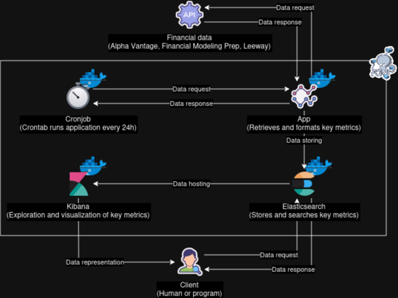
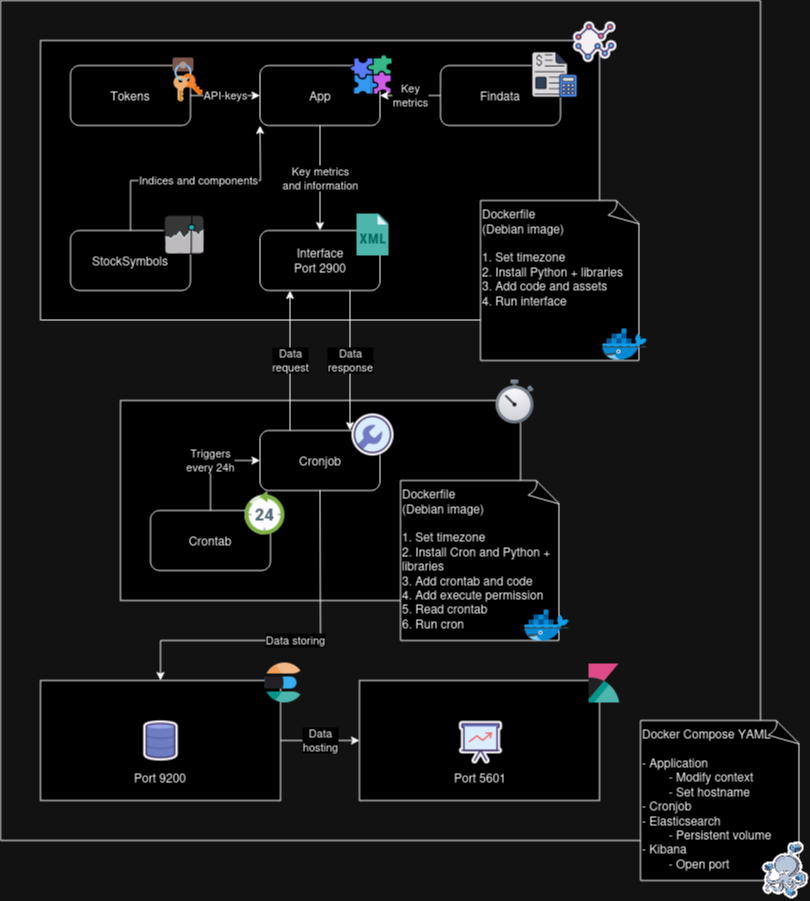

# Infrastructure

__Note:__ Some links can only be accessed in the universities' network (e.g. by connecting via the VPN).



## [Docker](https://www.docker.com/)
Docker is used to build and run Linux containers for multiple platforms, while Docker Compose is a tool for defining and managing multi-container applications. Together, they provide a powerful solution for containerization, making it easier to deploy and scale applications.

### Architecture


### Dockerfile
The working directory (WORKDIR) is used as the python path (searched for imports instead of the parent directory) unless it is explicitly defined as an environment variable by `ENV PYTHONPATH=<path>`.

### Networking
Docker Compose maintains a DNS that resolves the container_name property used in the [Docker Compose configuration](./compose/docker-compose.yml) to the relevant IP address.
When customizing ports, take a look at [this table](https://en.wikipedia.org/wiki/List_of_TCP_and_UDP_port_numbers) to avoid jam.

### Docker commands you should know:
(execute inside of the [docker compose folder](./compose/))
- `docker compose build [--no-cache]` builds all containers [from new]
- `docker compose up [-d]` runs all containers [in background]
- `docker ps` lists running containers
- `docker exec -it <container name> bash` opens shell on the container

## [Tickersymbols](https://www.ig.com/en/glossary-trading-terms/stock-symbol-definition) (Excursus)
Those abbreviations (usually 1-6 characters) identify stocks and indeces (mostly within one country). Thus, there may be different symbols for the same company or a company may be known under several symbols.

## [Elasticsearch](https://www.elastic.co/elasticsearch/)
Elasticsearch is a document-based database search engine that provides a [REST API](https://de.wikipedia.org/wiki/Representational_State_Transfer) that you can send requests to through its HTTP interface.
That way you have different options to communicate with the database: 
1. Transferring data with [cURL](https://curl.se/)
2. Using the [Kibana console](http://139.6.56.155:5601/app/dev_tools#/console)
3. Using a programming languages library like the [python client](https://elasticsearch-py.readthedocs.io/en/v8.9.0/)
4. Saving and sending requests with [postman](https://www.postman.com/)

The indices' data which is located at */usr/share/elasticsearch/data* on the guest machine will be persistently stored at */var/lib/docker/volumes/compose_elasticsearch_volume/_data* on the host machine.

### Database design
```json
{
  "lazy-investor": {
    "aliases": {},
    "mappings": {
      "properties": {
        "indices": {
          "type": "text",
          "fields": {
            "keyword": {
              "type": "keyword",
              "ignore_above": 256
            }
          }
        },
        "industry": {
          "type": "text",
          "fields": {
            "keyword": {
              "type": "keyword",
              "ignore_above": 256
            }
          }
        },
        "metrics": {
          "properties": {
            "equity_ratio": {
              "type": "float"
            },
            "ev_to_ebitda": {
              "type": "float"
            },
            "ev_to_sales": {
              "type": "float"
            },
            "gross_profit": {
              "type": "long"
            },
            "market_capitalization": {
              "type": "long"
            },
            "price_to_book_value": {
              "type": "float"
            },
            "price_to_earnings": {
              "type": "float"
            },
            "return_on_equity": {
              "type": "float"
            },
            "revenue_growth": {
              "type": "float"
            }
          }
        },
        "request": {
          "type": "text",
          "fields": {
            "keyword": {
              "type": "keyword",
              "ignore_above": 256
            }
          }
        },
        "sector": {
          "type": "text",
          "fields": {
            "keyword": {
              "type": "keyword",
              "ignore_above": 256
            }
          }
        },
        "symbol": {
          "type": "text",
          "fields": {
            "keyword": {
              "type": "keyword",
              "ignore_above": 256
            }
          }
        },
        "timestamp": {
          "type": "date"
        }
      }
    },
    "settings": {
      "index": {
        "routing": {
          "allocation": {
            "include": {
              "_tier_preference": "data_content"
            }
          }
        },
        "number_of_shards": "1",
        "provided_name": "lazy-investor",
        "creation_date": "1697468673744",
        "number_of_replicas": "1",
        "uuid": "nq4OdF_wRF60M7VP2PDAKw",
        "version": {
          "created": "8090199"
        }
      }
    }
  }
}
```

### Common requests
```yaml
# create index
PUT lazy-investor

# map timestamp to date
PUT /lazy-investor/_mapping
{
  "properties": {
    "timestamp": {
      "type": "date"
    }
  }
}

# show clusters
GET _cluster/health

# show nodes
GET _nodes/stats

# show db schema
GET lazy-investor

# delete index lazy-investor
DELETE /lazy-investor

# show all documents
GET /lazy-investor/_search

# show specific document by id
GET lazy-investor/_doc/2023-10-09_STOCK_AAPL_US_ALPHA_VANTAGE

# search for symbol IBM
GET /lazy-investor/_search
{
  "query": {
    "match": {
      "symbol": "IBM"
    }
  }
}

# search for stocks listed in SPX
GET /lazy-investor/_search
{
  "query": {
    "bool": {
      "must": [
        {
          "match": {
            "indices": "SPX"
          }
        }
      ]
    }
  }
}

# search for minimum price to earnings of 100
GET /lazy-investor/_search
{
  "query": {
    "range" : {
      "metrics.price_to_earnings": {
          "gte" : 100
      }
    }
  }
}

# search for documents created on 2023-10-14
GET /lazy-investor/_search
{
  "query": {
    "range": {
      "timestamp": {
        "gte": "2023-10-14",
        "lt": "2023-10-15"
      }
    }
  }
}

# remove all documents created before 2023-11-01
POST /lazy-investor/_delete_by_query
{
  "query": {
    "range": {
      "timestamp": {
        "lt": "2023-11-01"
      }
    }
  }
}
```

## App (Server)
Application logic procuring and transforming fundamental data.

### [app.py](./docker/app/app.py)
Main program, whose `document()` function is called to receive index, market or stock data.
Uses ss.py to retrieve basic data such as symbols needed for findata.py to receive financial data.

### [findata.py](./docker/app/findata.py)
Parses [multiple financial APIs](./api.md) to retrieve fundamental data and general information. Encapsulating (and caching) the data into objects provides a call-cost efficient way to calculate metrics.

### [ss.py](./compose/App/ss.py)
Uses a pretty neat API called [StockSymbol](https://github.com/yongghongg/stock-symbol/tree/master) to implement the generation of a JSON file that lists all stock symbols belonging to a given [index](./appendix/index_symbols.json) or [market](./appendix/market_symbols.json). This project saved us a lot of scraping like we did last time. However, it should be mentioned that, as is usual with APIs, server failures can occur. That's why we use the files generated once as a backup. Bug: Used *dr_market* instead of *de_market* in **market_list** attribute in case of german stocks.

### [interface.py](./compose/App/interface.py)
Restful XML-RPC server for responding to HTTP requests from Clients.

### tokens.py (not staged)
API-keys used for Alpha-Vantage, Financial Modeling Prep, Leeway and StockSymbol.

## [Cron](https://wiki.ubuntuusers.de/Cron/) (Client)
Service that enables scheduling the execution of bash commands.
When working with cronjobs, it's important to explicitly set the timezone on that (virtual) machine.

### [crontab](./compose/Cron/crontab)
Table that lists cronjobs specifying the minute, hour, day, month and weekday a command should be executed. They are either system wide or user related.

### [cronjob.py](./compose/Cron/cronjob.py)
Implements a XML-RPC client that requests findata from the application and sends it to the database via HTTP request. Communicates between application and database.

## Shared
Api and Sort Enum.

## ToDo:
- [x] Setup Docker compose
- [x] Install and configure Elasticsearch and Kibana
- [x] Finalize db schema
- [x] Install and configure cron
- [x] Rework application for multi-API calls
- [x] Design interface for application
- [x] Code script for data exchange between app and database which will be executed every 24h
- [x] Generate list of all index symbols
- [x] Add total count to index symbols information
- [ ] Add user password and encryption for Elastic stack (SSL/TLS)
- [x] Report typo to stock-symbol
- [x] Use backup data if server is not responding
- [x] Revise infrastructure drawing